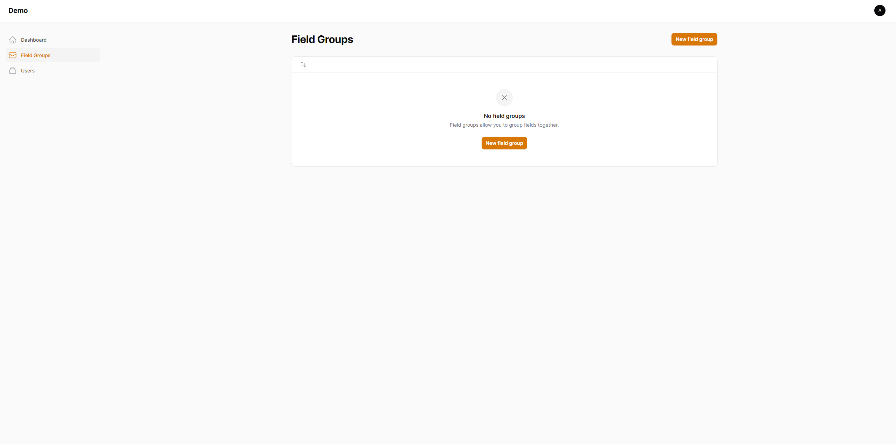

# Filament Field Group

[](https://packagist.org/packages/solutionforest/filament-field-group)
[](https://github.com/solutionforest/filament-field-group/actions?query=workflow%3Arun-tests+branch%3Amain)
[](https://github.com/solutionforest/filament-field-group/actions?query=workflow%3A"Fix+PHP+code+styling"+branch%3Amain)
[](https://packagist.org/packages/solutionforest/filament-field-group)


Filament Field Group is a powerful Laravel package that enhances Filament's form building capabilities. It allows you to easily group and organize form fields, improving the structure and readability of your forms. With this package, you can create collapsible sections, tabs, or custom layouts for your form fields, making complex forms more manageable and user-friendly.


## Installation

You can install the package via composer:

```bash
composer require solution-forest/filament-field-group
```

You can publish and run the migrations with:

```bash
php artisan vendor:publish --tag="filament-field-group-migrations"
php artisan migrate
```

You can publish the config file with:

```bash
php artisan vendor:publish --tag="filament-field-group-config"
```

Optionally, you can publish the views using

```bash
php artisan vendor:publish --tag="filament-field-group-views"
```

This is the contents of the published config file:

```php
return [
    'enabled' => false,
    'field_types' => [
        \SolutionForest\FilamentFieldGroup\FieldTypes\Configs\Text::class,
        \SolutionForest\FilamentFieldGroup\FieldTypes\Configs\TextArea::class,
        \SolutionForest\FilamentFieldGroup\FieldTypes\Configs\Email::class,
        \SolutionForest\FilamentFieldGroup\FieldTypes\Configs\Password::class,
        \SolutionForest\FilamentFieldGroup\FieldTypes\Configs\Number::class,
        \SolutionForest\FilamentFieldGroup\FieldTypes\Configs\Url::class,
        \SolutionForest\FilamentFieldGroup\FieldTypes\Configs\Select::class,
    ],
    'models' => [
        'field' => \SolutionForest\FilamentFieldGroup\Models\Field::class,
        'field_group' => SolutionForest\FilamentFieldGroup\Models\FieldGroup::class,
    ],
    'table_names' => [
        'fields' => 'advanced_fields',
        'field_groups' => 'advanced_field_groups',
    ],
];
```

## Usage

1. Enable the Field Group resource by setting `enabled` to `true` in the config file:
```php

// config/filament-field-group.php
return [
'enabled' => true,
// ... other config options
];
```


2. Create field groups and fields, for example:

   - Navigate to the Field Group resource in your Filament admin panel.
   - Create a new field group (e.g., "User Basic Info").
   - Add fields to the group (e.g., name, email, etc.).


3. Apply field groups to your form schema:
```php

use SolutionForest\FilamentFieldGroup\Facades\FilamentFieldGroup;

public static function form(Form $form): Form
{
    return $form
        ->columns(1)
        ->schema([
            FilamentFieldGroup::findFieldGroup('user_basic'),
            FilamentFieldGroup::findFieldGroup('user_detail'),
        ]);
}
```


## Testing

```bash
composer test
```

## Changelog

Please see [CHANGELOG](CHANGELOG.md) for more information on what has changed recently.

## Contributing

Please see [CONTRIBUTING](.github/CONTRIBUTING.md) for details.

## Security Vulnerabilities

Please review [our security policy](../../security/policy) on how to report security vulnerabilities.

## Credits

- [alan](https://github.com/solutionforest)
- [All Contributors](../../contributors)

## License

The MIT License (MIT). Please see [License File](LICENSE.md) for more information.
